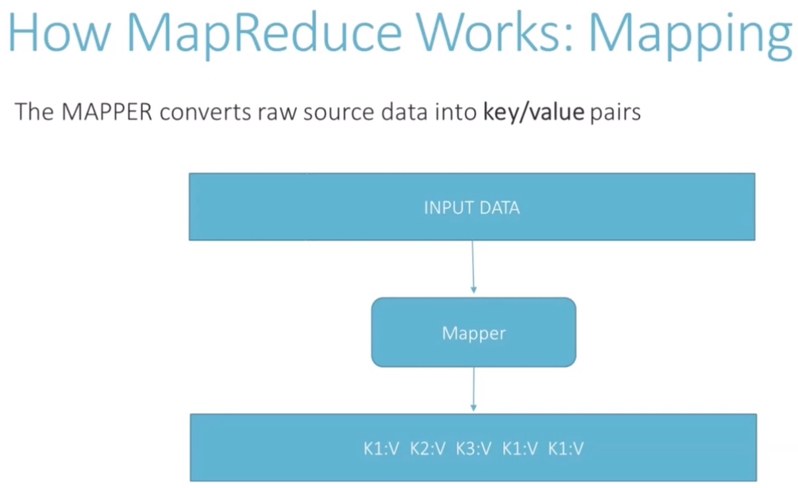
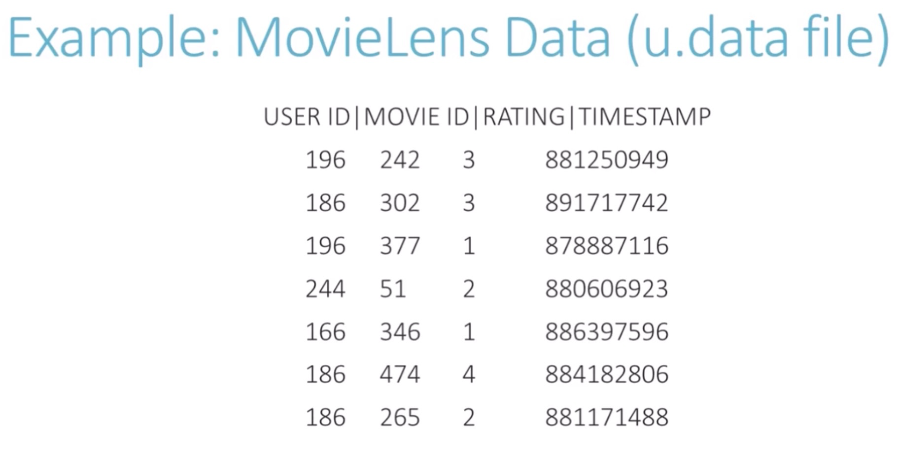
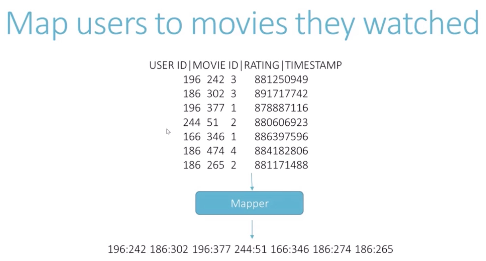
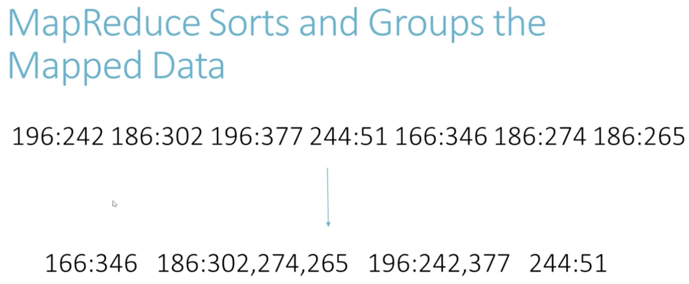
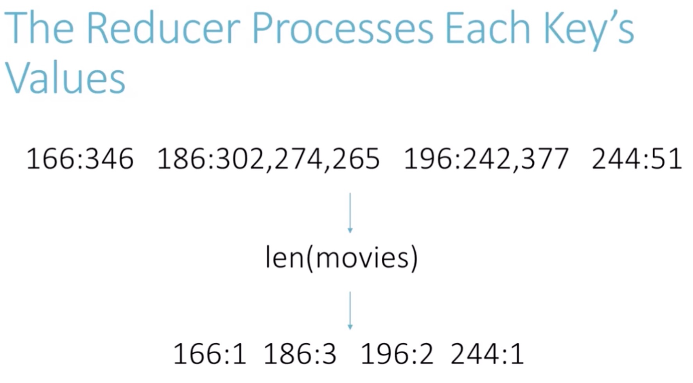
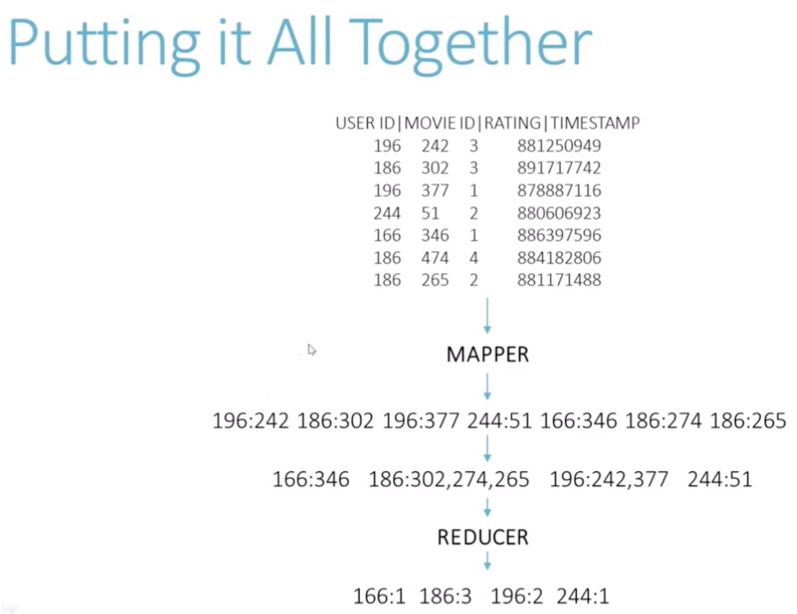
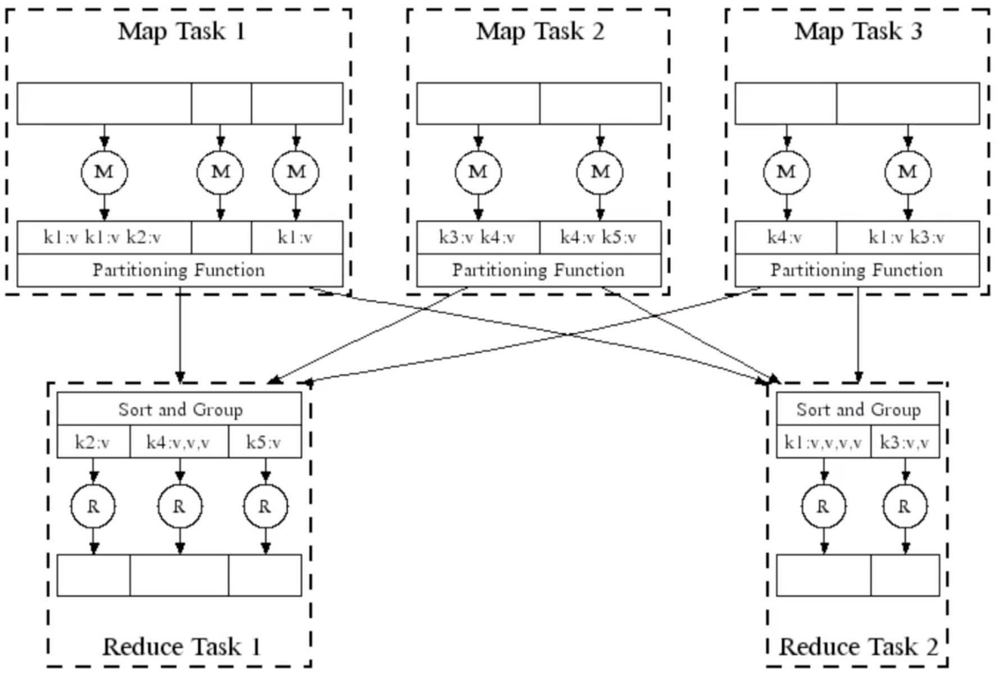
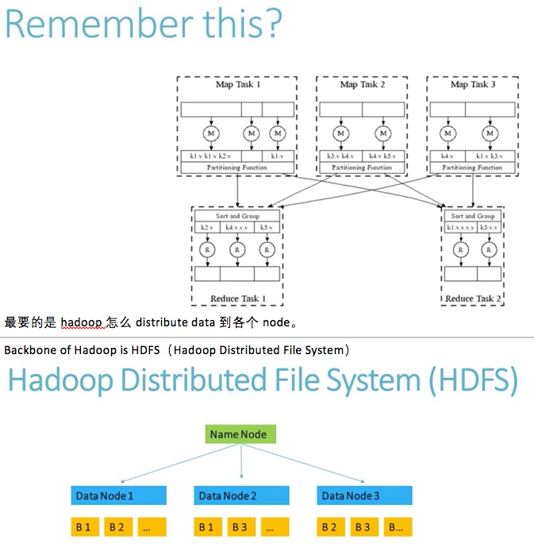
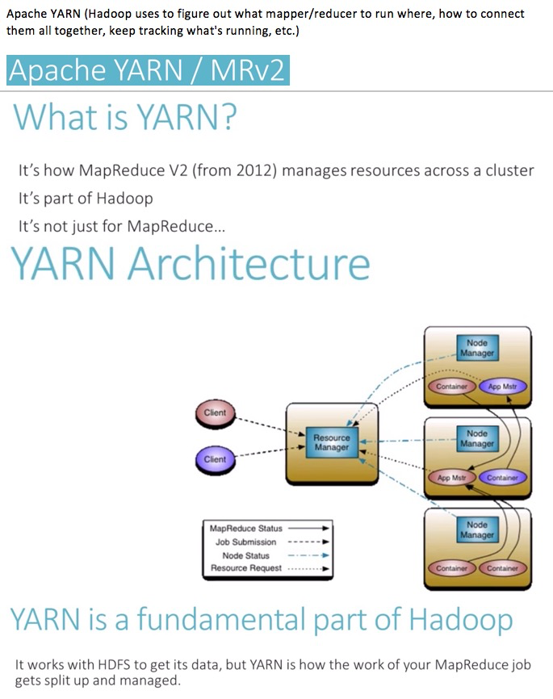
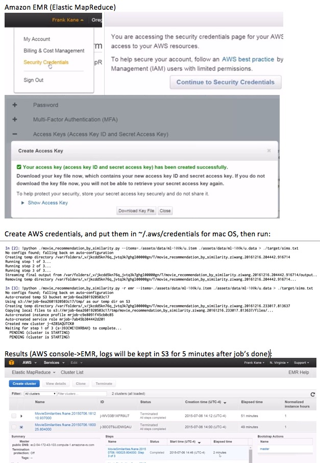

# Big data (movie ratings) based on Hadoop and MapReduce

## MapReduce

* Exmaple:
    * how many movies that each user has watched? => key: user_id and value: movie_id, now duplicate keys are ok, since reducer will handle that later.
    

    Map:
    

    

    

    Reduce:
    

    All:
    

    * Code snippet: # of movies for each rating?
        * Fields: user_id movie_id rating timestamp
        

* Combiner: when mapper is done producing key-value pairs, do some reduction work in mapper, like aggregating data before sending to reducer to save some network bandwidth.
    - ex: ./word_frequency_with_combiner.py

* Attach config/data file with each MapReduce job across distributed nodes: ./most_popular_movie_with_name_lookup.py

* How MapReduce scales / distributed computing:       
    

## Hadoop (Run MapReduce job in a distributed way)

* HDFS (Hadoop Distributed File System): is used by Hadoop for distributing data and information that Hadoop accesses, YARN manages how Hadoop jobs distributed across the cluster.

* Apache YARN (Hadoop uses to figure out what mapper/reducer to run where, how to connect them all together, keep tracking what's running, etc.)

* AWS Elastic MapReduce

## Tools

* Python tool for big data: [Enthought canopy](https://www.enthought.com/)
    * mrjob package: for MapReduce
    Editor -> !pip install mrjob
* Sample data: http://grouplens.org/
    * datasets -> MovieLens 100K Dataset (ml-100k.zip)
